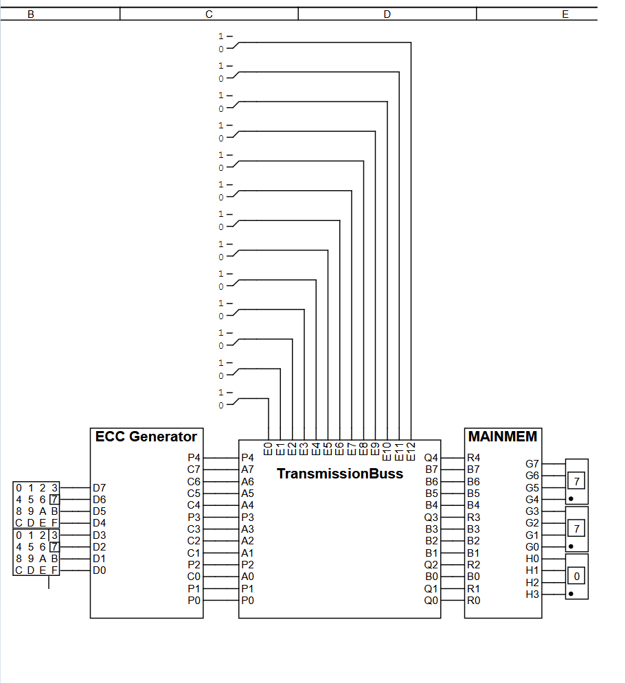
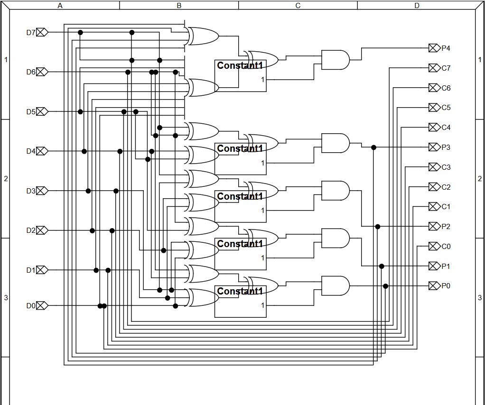
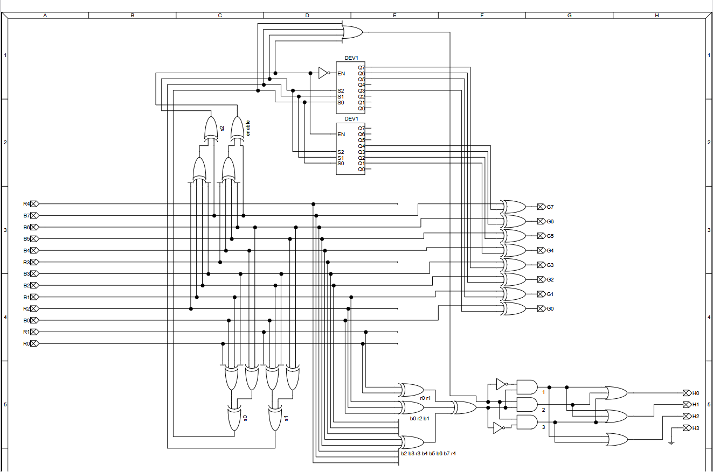
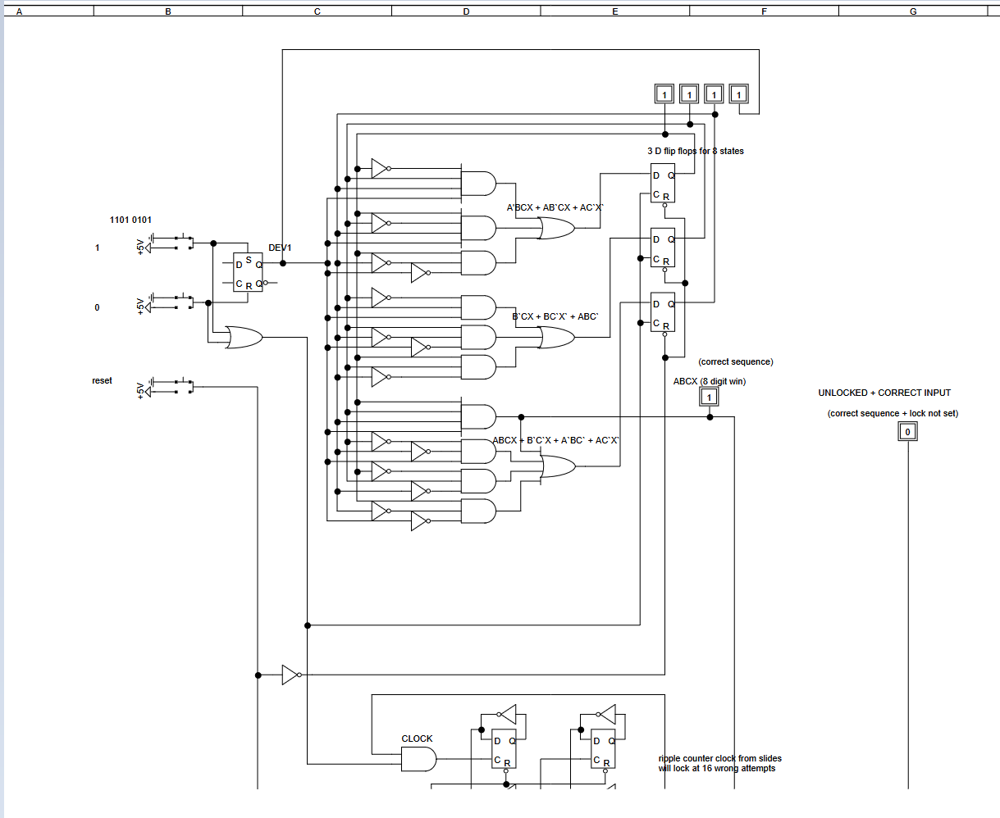

## Digital Logic Diagrams: 8-Bit SECDED ECC & Finite State Machines

The schematics include both **combinational logic** (1/2/3) and **sequential logic** (4) systems

### ECC Memory: Combinational Logic
* **8-bit SECDED**: Implements Single Error Correction, Double Error Detection
* **ECC Generator**: Generates 5 parity bits through a network of XOR gates
* **Main Memory**: Uses parity bits to detect, fix single-bit corruption and detect two-bit corruption

### Finite State Machine (FSM): Sequential Logic
* **Sequence Detector**: Built using D Flip-Flops to manage system states
* **Lock**: Includes a ripple counter that triggers a system lock after 16 failed input attempts

---

### Logic Schematics

#### 1. System Architecture Overview
Block diagram, includes bit flipper to simulate flipped bits/errors

#### 2. ECC Generator
XOR-based parity bit creation (hamming code based)

#### 3. Main Memory & Correction Unit
Combinational logic for real-time error detection/correction

#### 4. FSM - Digital Lock
Sequential Logic, ripple counters and state transition logic

